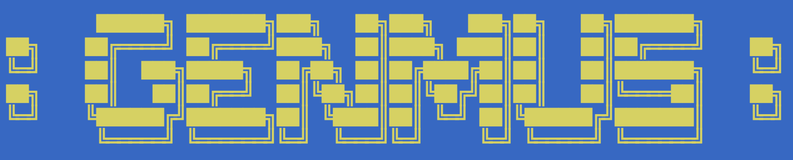

# genmus: a Genetic Music Player
### Oliver Bonham-Carter, [Allegheny College](https://allegheny.edu/)
### email: obonhamcarter@allegheny.edu

---

Genetic Music: Use your ears to study DNA!!

## Description

DNA to Piano Music Converter: Put DNA sequences into piano from PubMed FASTA files.

## Running the code

	 [--bighelp] This page, right?
	 [--opt S] Create a music scale
	 [--opt T] Create song: Twinkle-Twinkle Little Star
	 [--opt H] Create song: Happy Birthday
	 [--data ./data --file file.fasta] Load fasta file, convert dna to score
	 Setup with Poetry :  poetry install

     😀 USAGE: poetry run genmus --dir ./data/ --file mydata.fasta 

## How does Music Come From DNA Sequence?!

As you may know, protein is synthesized from
amino acids. Each amino acid is encoded by
three adjacent DNA bases (called "condons"
or "triplets") from a sequence of DNA (a
gene). GenMus works by pretending to
synthesize proteins, only not by creating
protein product, but by making music.
Instead of a sliding window that reads in
three bases at a time to determine the
placement of an amino acid, the three bases
are actually converted to musical notes.

The conversion begins as a list of words
of three bases which are taken from the
DNA sequence. For each particular word which
is encountered in the DNA sequence, a frequency
is recorded. The words having the most frequent
occurrence are labeled as the "common" words from
a sequence. For example, the DNA sequence
`ATC-ATC-AAA` has two occurrences of `ATC`
and one of `AAA` with this given reading frame.   

In a musical score, there are also common notes
that you may hear. For example, in "Twinkle
Twinkle Little Star" there are a good number
of notes that are heard far more than others.
GenMus knows the common notes of this child's
song and then pairs the commonly encountered
condons from a sequence of DNA with the common
musical notes. The sound that you hear from the
program has been generated by sliding window
(moving in step three) of a DNA sequence to
recognize codons and play a note that conforms
to its frequency, in conjunction with that of
frequency of notes of the song.   

### Documentation to come

This is a program to convert DNA sequenes to piano music.
The documentation for this project is coming soon to help
users to use and enjoy this project. In the meantime,
there is online help in the Python code to help the
user to run the program.
